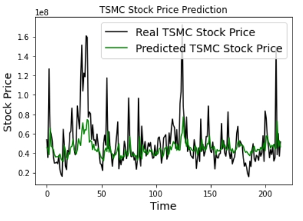

# RNN-TSMC-stock-price-prediction
Predict TSMC stock price with Simple RNN

Implement [one-to-one, many-to-one, and many-to-many RNN](http://karpathy.github.io/2015/05/21/rnn-effectiveness/) with only one feature (which is `Volume`)
and many-to-many RNN with all feature (Volume, open, close, max, min)

# Requirements

- `python3` and `tensorflow, sklearn, numpy, pandas, matplotlib`
- `pip install FinMind`

